# Energy-Inspired Portfolio Optimization

Simulates portfolio optimization using physics-inspired energy minimization, gradient descent, and finance concepts.

---

## Abstract

This project implements a portfolio optimization framework inspired by physics energy minimization. It progressively explores:

1. **Simulated asset returns and covariances**  
2. **Gradient descent optimization with energy-based loss**  
3. **Advanced optimizers (Adam vs Gradient Descent)**  
4. **Efficient Frontier and robust portfolio analysis**  

The simulations combine numerical optimization, visualization, and financial theory to demonstrate practical portfolio allocation and interdisciplinary reasoning.

---

## Why This Project

- Demonstrates how physics-inspired energy concepts can guide portfolio optimization.  
- Highlights hands-on implementation of gradient descent and advanced optimizers.  
- Visualizes optimizer convergence, efficient frontiers, and robust portfolio performance.  
- Combines static plots and GIFs to illustrate optimization progression and results.

---

## Development Iterations

- **v1.0:** Parameter setup and simulated data  
- **v2.0:** Gradient descent implementation and energy convergence  
- **v3.0:** Advanced optimization techniques and verification  
- **v4.0:** Weights convergence visualization  
- **v5.0:** Real and simulated data integration  
- **v6.0:** Optimizer comparison (Gradient Descent vs Adam)  
- **v7.0:** Efficient Frontier and robust portfolio evaluation  

---

## Verification

- Loss and energy convergence verified  
- Portfolio weights tracked across iterations  
- Optimized risk-return trade-offs validated  
- Efficient frontier matches theoretical expectations  

---

## Requirements

- Python 3.11+  
- NumPy  
- Pandas  
- Matplotlib  
- SciPy  
- yfinance (for real financial data)  
- Plotly / Plotly Express (optional for interactive visualization)  

---

## Phase 1: Parameter Setup

**Scientific Question:**  
“What are the initial portfolio parameters and constraints?”

**Description:**  
- Defines number of assets, expected returns, and covariance matrix.  
- Sets hyperparameters λ (risk factor) and γ (energy penalty).  
- Initializes portfolio weights and constraints (no shorting).  

**Implementation:**  
- Number of assets: `N = 5`  
- Expected returns: `[0.05, 0.08, 0.12, 0.07, 0.09]`  
- Covariance matrix Σ (risk between asset pairs)  
- Initial weights: `[0.2, 0.2, 0.2, 0.2, 0.2]`  

**End-state / Outputs:**  
- Script: `scripts/phase1_setup.py`  
- Inputs initialized for optimization  

**What This Proves:**  
- Clear problem definition  
- Baseline setup for optimization phases  

---

## Phase 2: Gradient Descent & Energy Convergence

**Scientific Question:**  
“How does the portfolio energy/loss evolve with different risk-return and energy parameters?”

**Description:**  
- Runs gradient descent optimization for portfolio weights.  
- Explores 9 λ–γ combinations to study convergence and energy landscape.  

**Static Plots:**  

| λ | γ | Plot |
|---|---|------|
| 0.3 | 0.05 | 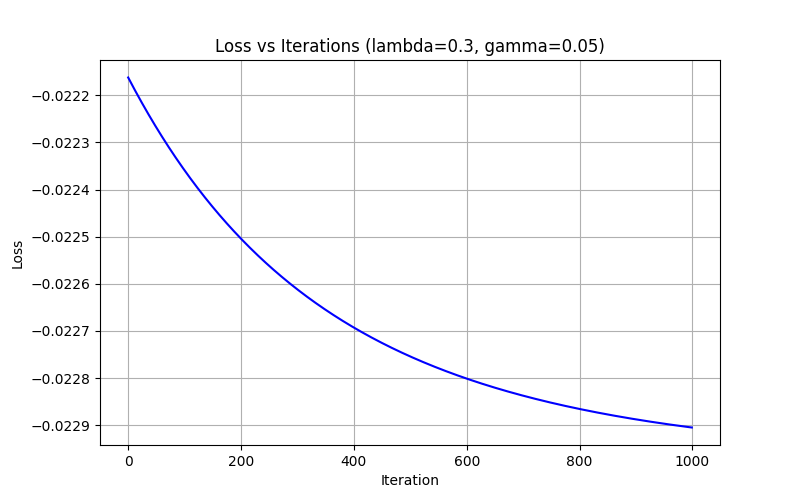 |
| 0.3 | 0.1 |  |
| 0.3 | 0.2 | 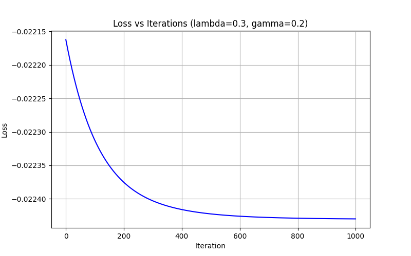 |
| 0.5 | 0.05 | 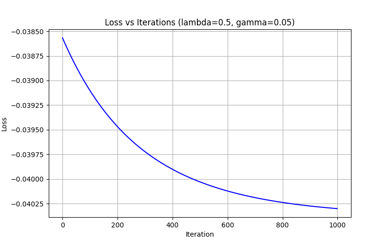 |
| 0.5 | 0.1 | 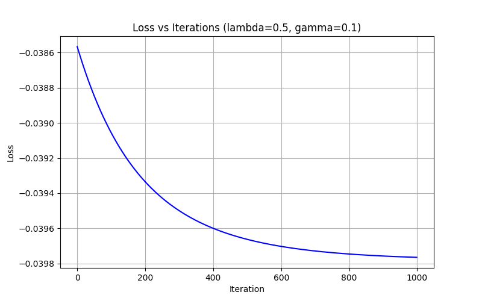 |
| 0.5 | 0.2 | 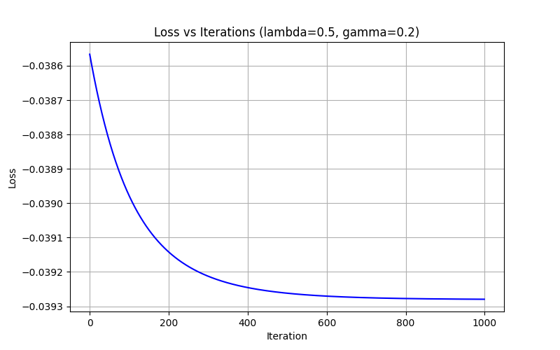 |
| 0.7 | 0.05 | 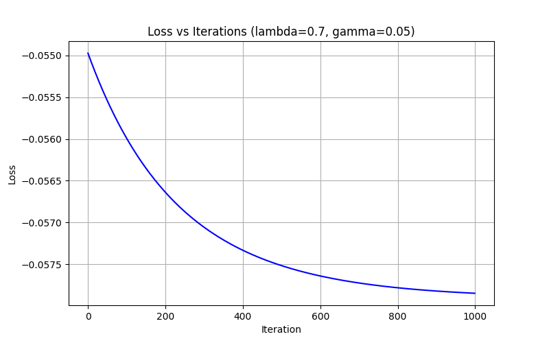 |
| 0.7 | 0.1 | 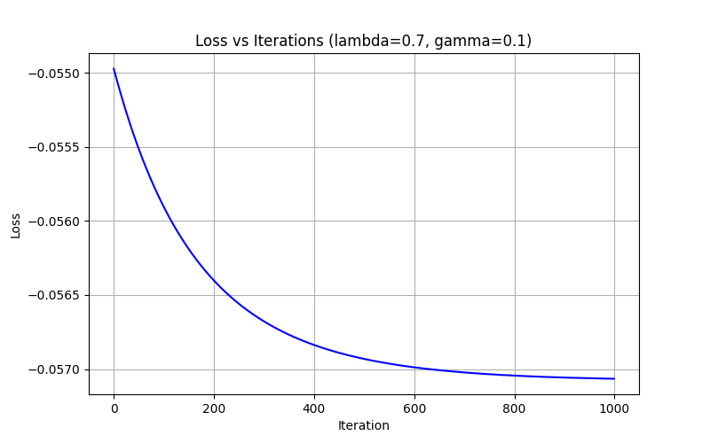 |
| 0.7 | 0.2 | 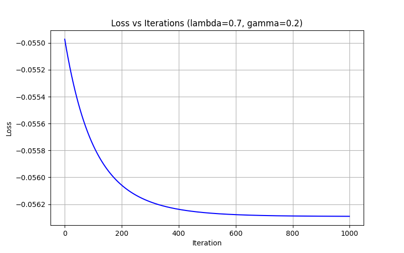 |

**Key Features:**  
- X-axis: Iterations  
- Y-axis: Energy / Loss  
- Shows parameter-dependent convergence  

**End-state / Outputs:**  
- Script: `scripts/phase2_gradient_descent.py`  
- Plots: 9 PNGs in `plots/`  

**What This Proves:**  
- Gradient descent convergence varies with λ and γ  
- Provides parameter guidance for optimization  

---

## Phase 3: Advanced Optimization & Verification

**Scientific Question:**  
“Are the optimization results reliable and interpretable?”

**Description:**  
- Tracks portfolio risk and returns  
- Compares optimizer outcomes and convergence  

**Static Plots:**  
  

**Animation / GIF:**  
  

**End-state / Outputs:**  
- Script: `scripts/phase3_advanced_optimization.py`  
- Plots: `phase3_loss_convergence.png`  
- GIF: `phase3_weights_convergence.gif`  

**What This Proves:**  
- Validates optimization results  
- Confirms reproducibility and convergence  

---

## Phase 4: Weights Convergence / Energy Landscape

**Scientific Question:**  
“What does the energy landscape look like for portfolio weights?”

**Description:**  
- Visualizes how portfolio weights evolve along the energy surface.  
- Highlights minima and convergence directions.  

**Animation / GIF:**  
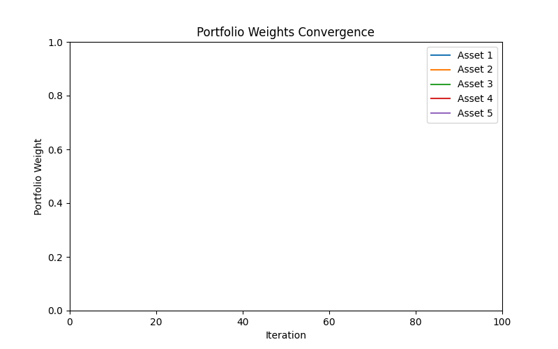  

**Static Plot:**  
None  

**End-state / Outputs:**  
- Script: `scripts/phase4_energy_landscape.py`  
- GIF: `phase4_weights_convergence.gif`  
- Plot: `phase4_energy_landscape.png`  

**What This Proves:**  
- Gradient descent follows energy minimization  
- Links physics-inspired energy to portfolio optimization  

---

## Phase 5: Data Generation & Simulation

**Scientific Question:**  
“Can simulated asset paths demonstrate portfolio behavior?”

**Description:**  
- Generates synthetic asset prices  
- Computes daily returns and portfolio evolution  

**Static Plots:**  
None

**End-state / Outputs:**  
- Script: `scripts/phase5_simulated_data.py`  
- Plots: simulated asset paths and daily returns  

**What This Proves:**  
- Optimization framework works with synthetic data  
- Demonstrates risk-return evolution visually  

---

## Phase 6: Optimizer Comparison

**Scientific Question:**  
“How does Adam optimizer compare with standard gradient descent?”

**Static Plots:**  
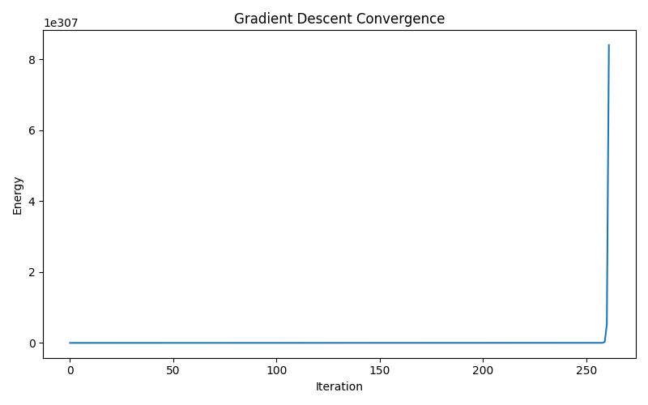  
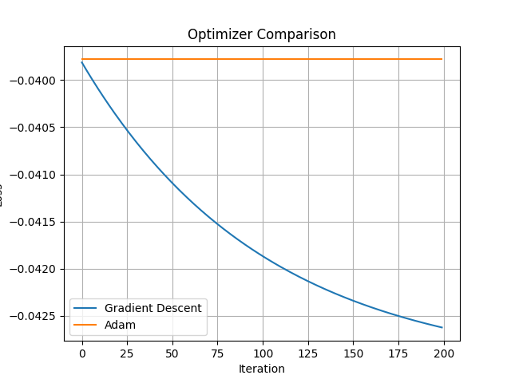  

**End-state / Outputs:**  
- Script: `scripts/phase6_optimizer_comparison.py`  
- Plots: gradient descent vs Adam comparison  

**What This Proves:**  
- Adam converges faster and avoids local minima  
- Demonstrates advanced optimization techniques  

---

## Phase 7: Efficient Frontier & Robust Optimization

**Scientific Question:**  
“How does portfolio performance vary under risk-return trade-offs?”

**Static Plots:**  
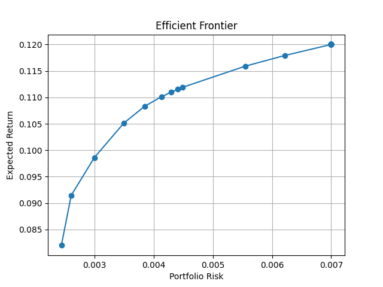  
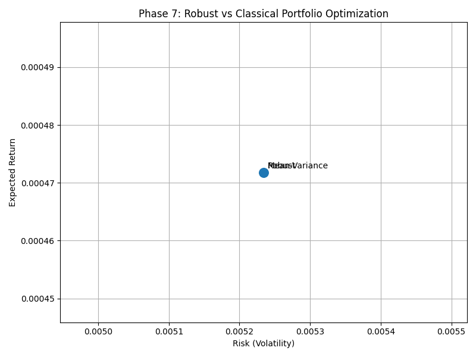  

**End-state / Outputs:**  
- Script: `scripts/phase7_efficient_frontier.py`  
- Plots: efficient frontier and robust portfolio comparison  

**What This Proves:**  
- Visualizes optimal portfolios  
- Confirms robust vs standard portfolio performance  

---

## Conclusion

This project demonstrates **energy-inspired portfolio optimization**, progressing from:

1. Parameter setup and simulated assets  
2. Gradient descent optimization  
3. Advanced optimizers (Adam)  
4. Weights convergence & energy landscape visualization  
5. Simulated asset paths and returns  
6. Optimizer comparisons  
7. Efficient frontier and robust portfolios  

- All results verified through static plots and GIFs.  
- Demonstrates interdisciplinary approach: physics-inspired energy + numerical optimization + finance.  
- Phase-wise documentation ensures reproducibility and clear storytelling.
